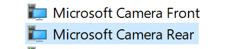
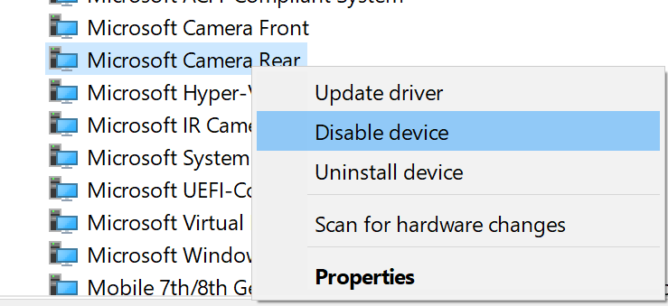

## Zusätzliche Einstellungen

### Kamera deaktivieren

Sollte Ihr Endgerät mehrere Kameras ausweisen, ist es wichtig die Kamera auf der **Rückseite des Gerätes** ausgeschaltet ist

1. Klicken Sie auf "Start" bzw. auf das "Windows-Symbol" und geben Sie in das Suchfeld "Geräte-Manager" (engl. Device Manager) ein. Klicken Sie auf den Eintrag.

1. Im Fenster "Geräte-Manger" suchen Sie den Eintrag "Systemgeräte" (engl. System Devices). Klicken Sie darauf. 

1. Unterhalb des Eintrags erscheinen alle Systemgeräte. Suchen Sie nach den Kameras des Geräts. 

1. Deaktivieren Sie die Kamera auf der **Rückseite** (engl. Rear camera) des Gerätes, in dem Sie  mit der rechten Maustaste auf den Eintrag dieser Kamera und anschließend auf "deaktiveren" (engl. disable) klicken.

1. Eventuell wird ein Pop-Up angezeigt, welches Sie darauf hinweist, dass Sie die Kamera deaktivieren und somit nicht mehr nutzen können

1. Die Kamera wird nun als "deaktiviert" angezeigt

**Hinweis**: Wenn Sie Ihre Kamera wieder aktivieren wollen, folgen Sie der obigen Anleitung erneut, klicken aber auf "aktivieren" (engl. enable) in Punkt 4

