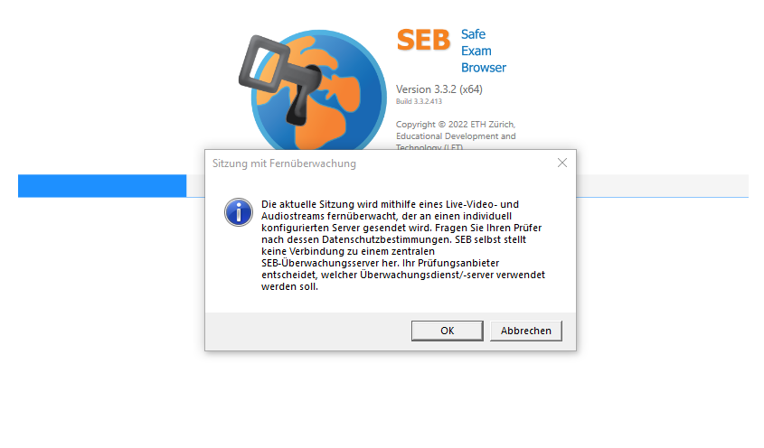
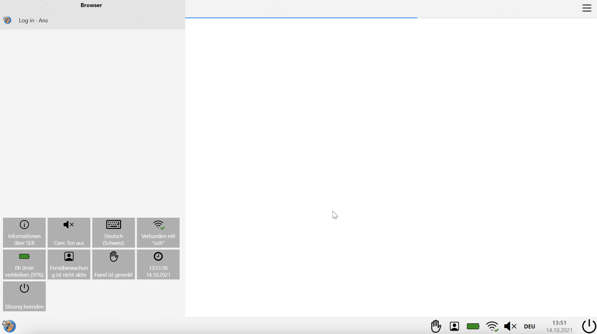
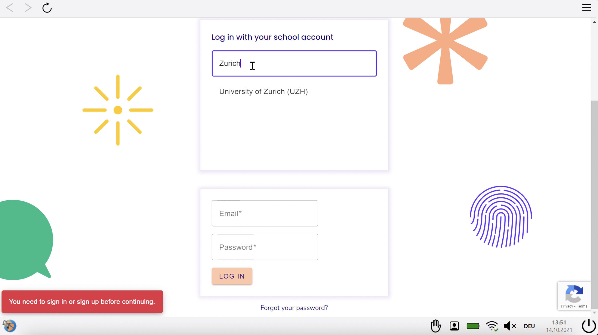
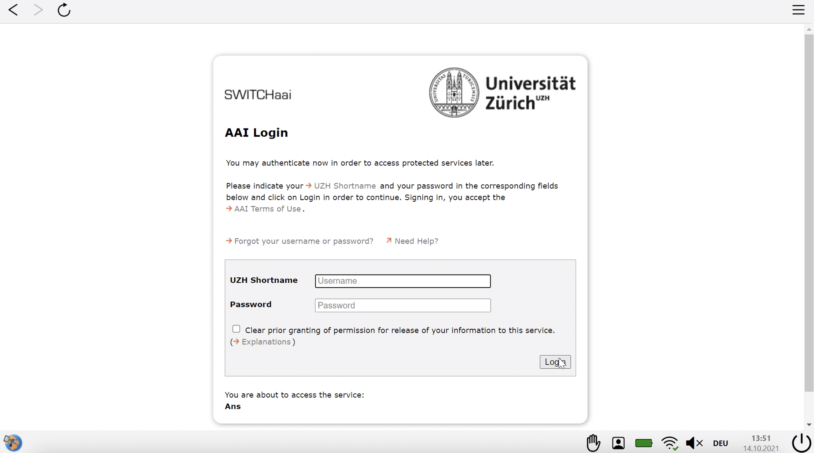

## SEB mit Ans

### Start der Prüfung
Bitte beachten Sie die Checkliste unter [Allgemeine Informationen](https://uzh-oec.github.io/seb/exam_general_de.html) {:target="_blank"}

1. Sie erhalten zeitnah zu jeder Prüfung eine Konfigurationsdatei mit der Endung **.seb** 
* per Email
* auf folgender Website

1. Laden Sie die Datei herunter, öffnen Sie die Datei und klicken Sie **OK** bei der folgenden Anzeige

1. Der SEB startet 

1. Nur kurz zeigt sich folgendes Bild

1. Als Nächstes lädt der SEB die Ans Plattform. Wählen Sie die Login-Option "Login with school account" und geben Sie **Zurich** oder **UZH** ein und wählen **University of Zurich (UZH)** aus

1. Bitte loggen Sie sich mit dem AAI Switch Login ein

1. Bei erfolgreichem Login wird Ihnen die Ans Plattform angezeit. 

1. Navigieren Sie nun zu der Prüfung:
* Hat die Prüfungszeit noch nicht begonnen, finden Sie die Prüfung unter **Scheduled assignments**
* Hat die Prüfung bereits gestartet, finden Sie die Prüfung unter **Live assignments**
Alle weiteren Informationen zu Ans finden Sie [hier](https://uzh-oec.github.io/ans/exam-navigation-de.html) {:target="_blank"}

### Während der Prüfung

Der Safe Exam Browser hat am oberen und unteren Rand ein paar Features, welches hier genauer erläutert werden.

**Oben links:** 
* Back - Button
* Refresh-Button

**Oben rechts:**
* Menu-Icon

**Unten rechts:**
Von links nach rechts
* Hand-Raise-Icon
* Profil-Icon
* Battery Icon
* Audio-Icon
* Language Setting
* Zeit und Datum
* Exit Knopf

### Beenden der Prüfung
(Weitere Informationen folgen)
