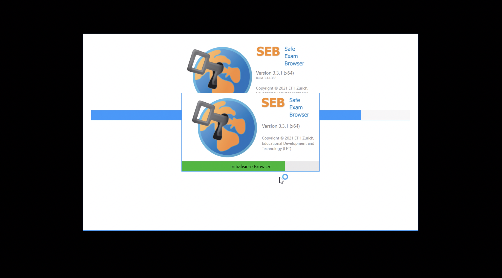

## SEB mit Ans

### Start der Prüfung
Bitte beachten Sie die Checkliste unter [Allgemeine Informationen](https://uzh-oec.github.io/seb/exam_general_de.html {:target="_blank"})

1. Sie erhalten zeitnha zu jeder Prüfung eine Konfigurationsdatei mit der Endung **.seb** 
* per Email
* auf folgender Website

1. Laden Sie die Datei herunter, öffnen Sie die Datei und klicken Sie **OK** bei der folgenden Anzeige

1. Der SEB startet 

1. Nur kurz zeigt sich folgendes Bild

1. Als Nächstes lädt der SEB die Ans Plattform. 

1. Bitte loggen Sie sich mit dem AAI Switch Login ein

1. Bei erfolgreichem Login wird Ihnen die Ans Plattform angezeit

### SEB Features

(Weitere Informationen folgen)
