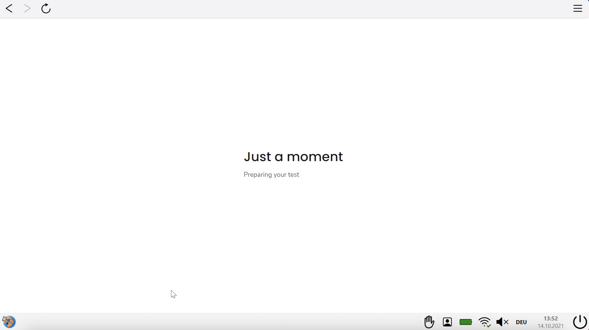

## SEB mit Ans (Windows)
{: .no_toc }

1. Inhaltsübersicht
{:toc}

---

### Start der Prüfung
Bitte beachten Sie die Checkliste unter [Allgemeine Informationen](https://uzh-oec.github.io/seb/exam_general_de.html){:target="_blank"}

1. Sie erhalten zeitnah zu jeder Prüfung eine Konfigurationsdatei auf folgender Website: [https://oec.uzh.ch/de/seb](https://oec.uzh.ch/de/seb){:target="_blank"}

1. Sobald Sie sich auf der oben genannten Website befinden, gehen Sie zum Abschnitt **Modulspezifische Informationen** und wählen Ihr Modul an.

1. Auf der jeweiligen Modulseite finden Sie verschiedene Testläufe sowie die Prüfung aufgelistet. Gehen Sie zu dem jeweiligen  (z.B. Infrastrukturtest), für den Sie die Konfigurationsdatei benötigen, und wählen Sie **DATEINAME starten** (hier "Infrastrukturtest starten). 

1. Öffnen Sie die Datei und klicken Sie **OK** bei der folgenden Anzeige

1. Der SEB startet 

1. Nur kurz zeigt sich folgendes Bild

1. Als Nächstes lädt der SEB die Ans Plattform. Wählen Sie die Login-Option "Login with school account" und geben Sie **Zurich** oder **UZH** ein und wählen **University of Zurich (UZH)** aus

1. Bitte loggen Sie sich mit dem SWITCHaai Login ein

1. Generell wird Ihnen innerhalb der Ans Plattform die Prüfung direkt angezeigt.
**Hinweis**: sollte die Prüfung nicht angezeigt werden (z.B. Fehlermeldung "Access denied" / "Incorrect configuration detected), klicken Sie oben links auf das **ans** Logo und suchen Sie nach der Prüfung:
* Hat die Prüfungszeit noch nicht begonnen, finden Sie die Prüfung unter **Scheduled assignments**
* Hat die Prüfung bereits gestartet, finden Sie die Prüfung unter **Live assignments**
Alle weiteren Informationen zu Ans finden Sie [hier](https://uzh-oec.github.io/ans/exam-navigation-de.html){:target="_blank"}

1. Wählen Sie die Start-Schaltfläche (falls die Prüfung noch nicht Life ist, sehen Sie diese **nach** dem Countdown)

1. Die Prüfung wird kurz geladen

1. Die Prüfung wird nun angezeigt.
Alle weiteren Informationen zu Ans finden Sie [hier](https://uzh-oec.github.io/ans/exam-navigation-de.html){:target="_blank"}

### Während der Prüfung

Der Safe Exam Browser weist am oberen und unteren Rand Symbole auf, welche hier genauer erläutert werden.

**Oben links:** 
* Back-Button
* Refresh-Button

**Oben rechts:**
* Menu-Icon

**Unten rechts:**
Von links nach rechts
* Profil-Icon
* Battery Icon
* Audio-Icon
* Spracheinstellung: Die Anzeige ist entweder **DEU** oder **EN** und bezieht sich auf die Tastatursprache
* Zeit und Datum
* Exit Knopf: bei Betätigung des Knopfes wird ein Passwort erfragt, welches der Administrator hat. Da das Beenden des Safe Exam Browsers nicht erlaubt ist, muss bei Betätigung dessen im Pop-Up **Abbrechen** gewählt werden

### Beenden der Prüfung
 
Sie dürfen den Safe Exam Browser **nicht** vor Prüfungsende beenden. Ein vorzeitiger Ausstieg aus dem Safe Exam Browser gilt als Prüfungsbetrug. Klicken Sie **NICHT** auf den Button «Safe Exam Browser schliessen» bevor die Prüfungszeit abgelaufen ist.

