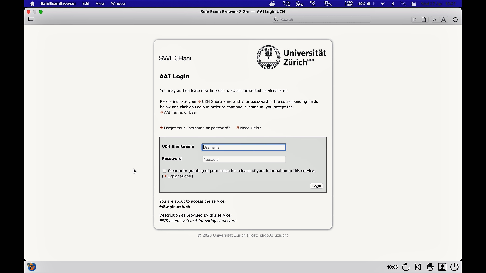

## SEB mit OLAT-EPIS (MacOS)
{: .no_toc }

1. Inhaltsübersicht
{:toc}

---

### Start der Prüfung

Bitte beachten Sie die Checkliste unter [Allgemeine Informationen](exam_general)

1. Loggen Sie sich im Firefox Browser auf OLAT-EPIS mit dem aaiSWITCH Login ein: [https://fs5.epis.uzh.ch](http://fs5.epis.uzh.ch){:target="_blank"}

1. Es erscheint ein Pop-Up, welches die aktuelle Prüfung anzeigt. Darin wird erläutert, dass die Prüfung nur mit dem Safe Exam Browser bearbeitet werden kann. Klicken Sie auf die **Safe Exam Browser Starten** Schaltfläche

1. Ein Fenster zeigt die Applikation **Safe Exam Browser** an um die Prüfung zu starten. Klicken Sie **Link öffnen** / **Open Link**

1. Während der SEB startet, zeigt sich ein Pop-Up, welches darauf hinweist, dass eine Videoüberwachung stattfindet. Drücken Sie **OK**  (es ist durchaus möglich, dass weitere Pop-Ups erscheinen z.B. das Zugreifen auf Kamera & Mikrofon oder das Schliessen einer Applikation)

1. Als Nächstes lädt der Safe Exam Browser die Prüfungsplattform OLAT und bittet Sie erneut sich einzuloggen. 

1. Bitte loggen Sie sich mit dem SWITCHaai Login ein

1.  Die Prüfung wird nun angezeigt.

### Während der Prüfung

Der Safe Exam Browser verfügt über verschiedenste Funktionen, welche mittels den Symbolen aufgerufen werden können. Je nach Version können diese an anderer Stelle oder gar nicht angezeigt werden.

Eine detailierte Übersicht zu den Symbolen und deren Funktion erhalten Sie auf dieser Seite:
[Symbole erklärt](icons_explained)

### Beenden der Prüfung

Sie dürfen den Safe Exam Browser **nicht** vor Prüfungsende beenden. Ein vorzeitiger Ausstieg aus dem Safe Exam Browser gilt als Prüfungsbetrug. Klicken Sie **NICHT** auf den Button «Safe Exam Browser schliessen» bevor die Prüfungszeit abgelaufen ist.
