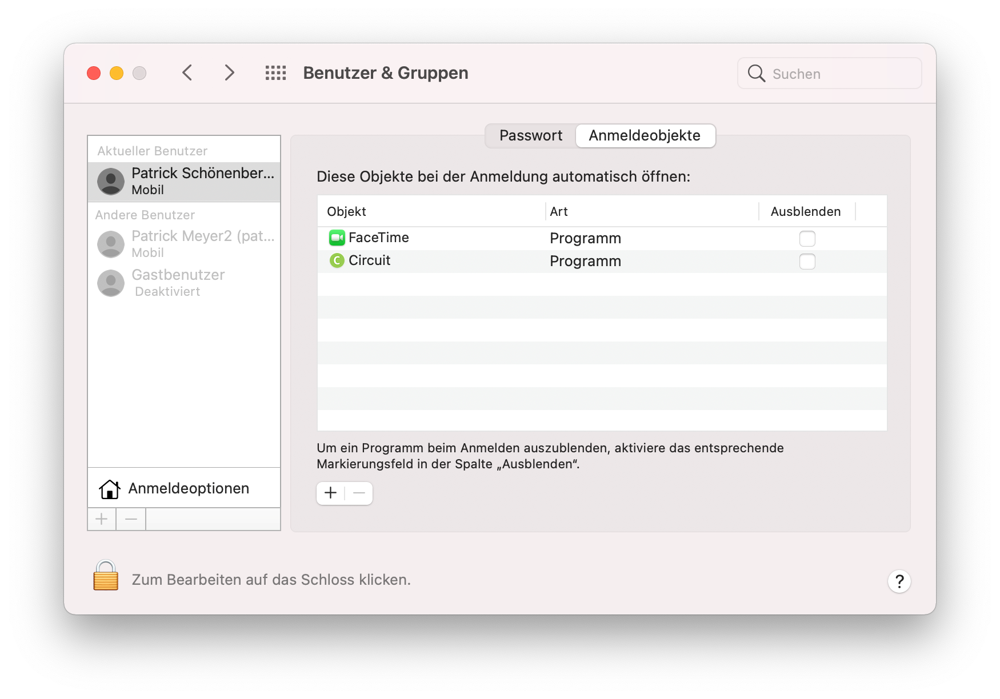

## Beschreibung
Beim Starten des SEB kann es vorkommen das der Bildschirm zu flackern beginnt (wechselt ständig zwischen SEB und Desktop). Dadurch wird das durchführen einer Prüfung verunmöglicht.

## Ursache
Es scheint das dieses Problem durch eine unerlaubte Software, welche im Hintergrund läuft, verursacht wird. Diese stört den SEB und führt zu unerwünschtem Verhalten.

## Lösung
Zuerst muss die Software gefunden werden, welche das Problem verursacht. Am besten startet man den Computer neu und schaut ob das Problem danach immer noch besteht.

**Falls es nicht mehr besteht**, bedeutet dies das die störende Software nicht automatisch, sondern vom Benutzer selbst gestartet wurde. Versuchen Sie sich zu erinnern, welche Software Sie zuvor gestartet haben und deaktivieren Sie diese. Danach probieren Sie den Safe Exam Browser nochmals zu starten.

**Falls es noch besteht**, bedeutet dies, dass die Software automatisch gestartet wird. Versuchen Sie herauszufinden welche Software beim Start Ihres Computers automatisch gestartet wird.

Unter Windows sehen Sie dies in Taskmanager -> Autostart

Bei MacOs gehen Sie zu Users & Group -> Login Items

Versuchen Sie diese Software zu deaktivieren und testen Sie den SEB nochmals.
Stellen Sie sicher, dass diese Software während der Prüfung nicht aktiviert ist.