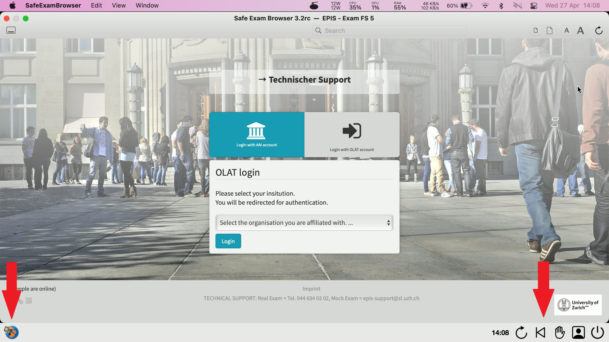
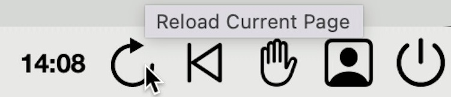
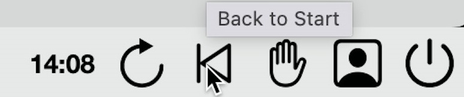
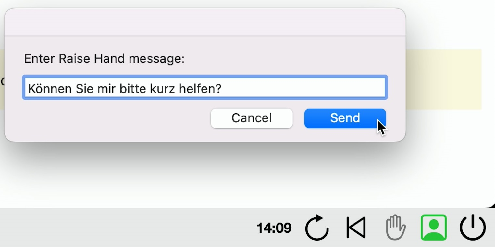
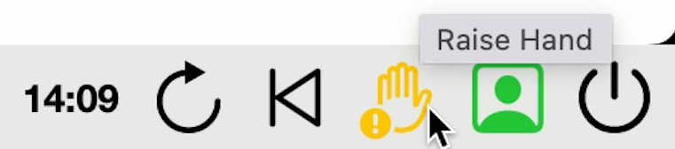
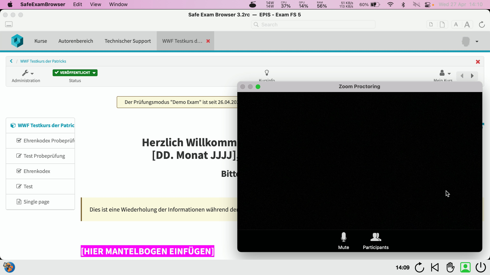
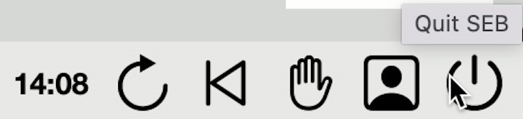
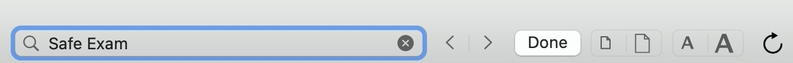

## Symbole im Safe Exam Browser (SEB)
Der SEB verfügt über diverse Zusatzfunktionen welche je nach Betriebssytem und Prüfung an anderer Stelle zu finden sind. Die folgenden Beispiele wurden auf dem MacOS Betriebssystem erstellt, die Funktionalität ist jedoch für alle Betriebssyteme gleich.

Auf der linken Seite befindet sich der «SEB Button». Durch einen Klick auf diesen wird die Seite neu geladen. Dies kann hilfreich sein, falls der SEB nur eine schwarze Seite anstelle der Prüfung anzeigt.

Auf der rechten Seite befinden sich die weiteren Symbole. Mit einem Klick auf «Reload», wird die aktuelle Seite neu geladen.

Der Button “Back to Start” sollte nicht geklickt werden, da dieser wieder an den Anfang des SEB springt und dazu führen kann, dass die Prüfung verloren geht.

Mit einem Klick auf das «Hand» Symbol wird die Prüfungsaufsicht darüber informiert das man Hilfe benötigt. Je nach Betriebssystem kann durch einen langen Klick auf dieses Symbol auch eine Nachricht an die Aufsichtsperson übermittelt werden. Schildern Sie hier in kurzen Worten Ihr Problem.

Nach dem Klick auf das «Hand» Symbol ändert dieses seine Farbe auf Gelb und signalisiert damit, dass man die Hand gehoben hat. Eine Aufsichtsperson wird sich nun schnellstmöglich melden. Hat man fälschlicherweise auf das «Hand» Symbol geklickt, so bewirkt ein erneutes klicken, dass die Hand wieder gesenkt wird.

Wird die Prüfung per Video beaufsichtigt, so erscheint der «Proctoring Button» in grün. Dies bedeutet, dass die Kamera ein Bild übermittelt.

Mit einem Klick auf den «Proctoring Button» öffnet sich das Zoom Proctoring Fenster. Dieses Zeigt die anderen Teilnehmer der Prüfung an, ist jedoch schwarz, falls keine anderen Teilnehmer vorhanden sind.

Der Button «Quit» bewirkt das der SEB geschlossen wird. Abhängig von der entsprechenden Prüfung wird zum endgültigen Schliessen noch ein Passwort benötigt. Dieses wird von der Prüfungsleitung am Ende der Prüfung bekannt gegeben. Schliessen Sie zur Sicherheit den SEB während der Prüfung niemals ohne von der Prüfungsleitung dazu aufgefordert worden zu sein, da ein frühzeitiges Beenden des SEB während der Prüfungszeit als Betrugsversuch gewertet wird.

Im oberen Teil von SEB gibt es eine Suchfunktion und Zoomfunktionen. Mittels der Suchfunktion kann Text auf der Prüfungsseite gesucht werden. Dieser wird dann farblich hervorgehoben.

Mittels den Zoomfunktionen kann die ganze Seite vergössert/verkleinert oder nur der enthaltene Text vergrössert/verkleinert werden.

