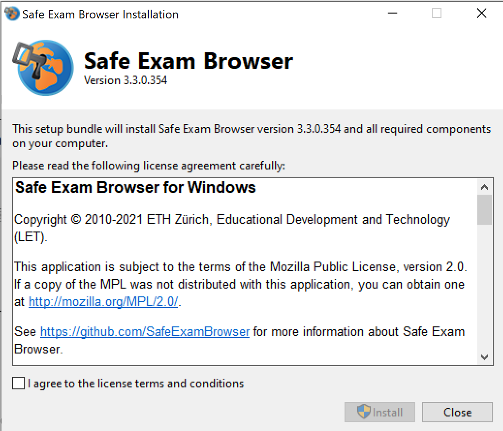
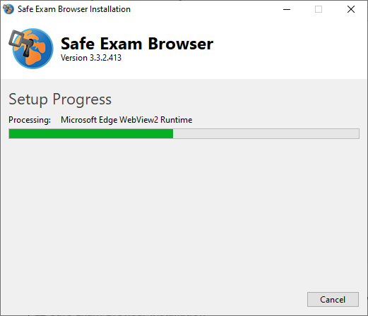
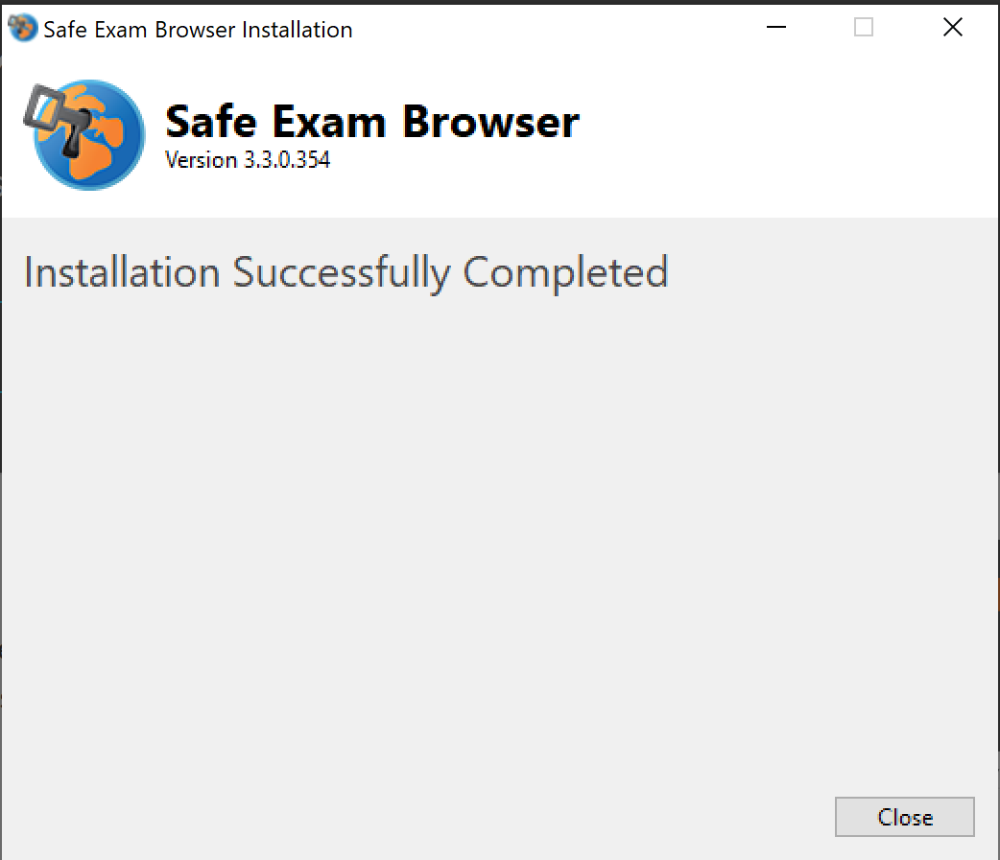
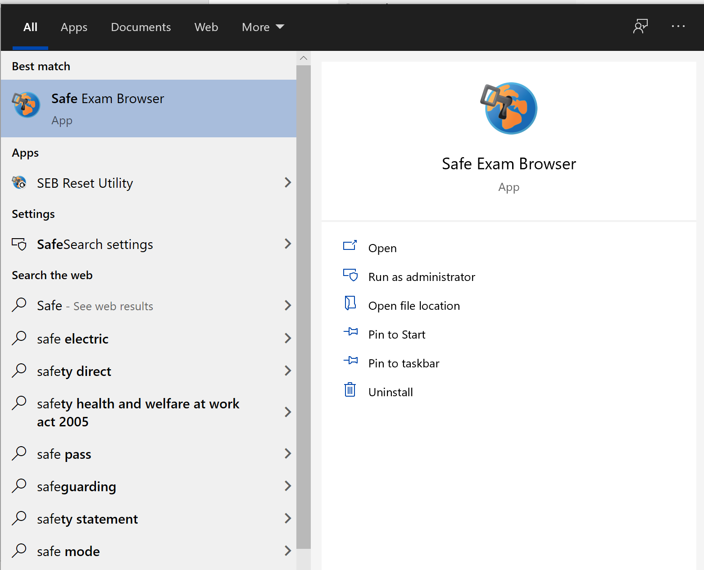

## Installation auf Windows

1. Laden Sie folgende SEB Version für Windows herunter:
Version 3.3.2, Download auf der folgenden Seite: [https://oec.uzh.ch/de/seb](https://oec.uzh.ch/de/seb){:target="_blank"}

1. Öffnen Sie die heruntergeladene Datei in Ihren Downloads (Doppelklicken oder rechte Maustaste & Öffnen)

1. Wählen Sie die Box «I agree to the license terms and conditions» und drücken Sie «Install»

1. Der Safe Exam Browser wird installiert

1. Ist der Safe Exam Browser installiert, wird dies wie folgt angezeigt:

1. Schliessen Sie das Installationsfenster und suchen Sie in Ihrer Suchfunktion unten links nach «Safe Exam Browser».
Wenn Sie den Safe Exam Browser sehen, so wurde dieser installiert. **Hinweis**: Ohne Konfigurationsdatei können Sie den SEB nicht starten (es erscheint ein Fehler).
Um den SEB zu testen, benötigen Sie eine Test-Konfiguration, welche Ihnen meist in Form eines Infrastruktur-Tests von der Prüfungsleitung zur Verfügung gestellt wird.

**Hinweis**: Für die Konfiguration wird Ihnen für jede Prüfung eine entsprechende **Konfigurations-Datei** zur Verfügung gestellt. Diese finden Sie hier [https://www.oec.uzh.ch/de/seb](https://www.oec.uzh.ch/de/seb){:target="_blank"}.

Für die Prüfung erfolgt das Starten des SEB bei Ans und OLAT-EPIS auf verschiedene Weise, ziehen Sie hierfür bitte die Erläuterung der jeweiligen Supportseiten heran:
* [Ans & SEB mit Windows](https://uzh-oec.github.io/seb/exam_seb_ans_win_de.html){:target="_blank"}.
* [Ans & SEB mit MacOS](https://uzh-oec.github.io/seb/exam_seb_ans_mac_de.html){:target="_blank"}.
* [EPIS-OLAT & SEB mit Windows](https://uzh-oec.github.io/seb/exam_seb_epis_win_de.html){:target="_blank"}.
* [EPIS-OLAT & SEB mit MacOS](https://uzh-oec.github.io/seb/exam_seb_epis_mac_de.html){:target="_blank"}.

Sollten Sie Probleme bei der Installation der Applikation haben, folgen Sie bitte den Schritten [hier](https://uzh-oec.github.io/seb/installation_problems_de.html){:target="_blank"}.