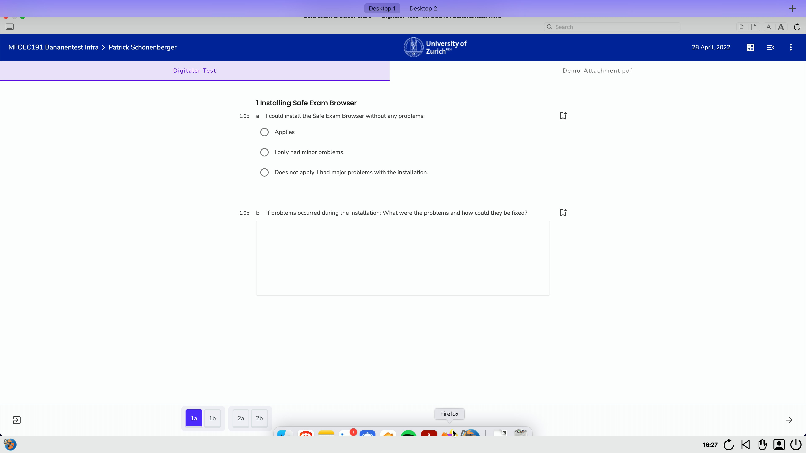

## Open Book mit Safe Exam Browser (SEB)
Es kann sein, dass Ihre Prüfung im Open Book Format durchgeführt wird. Abhängig von der gewählten Prüfung kann dies bedeuten, dass Sie Ihren Browser und andere Software (Word, PPT, PDF, etc.) verwenden dürfen. Da der SEB jedoch Ihre Toolbar respektive Ihr Dock ausblendet, müssen Sie das öffnen von Software in Open Book SEB Prüfungen vorgängig üben.

**Windows von Microsoft**
Unter Windows können Sie mit einem Klick auf die Windows-Taste auf Ihrer Tastatur das Startmenu anzeigen, über welches Sie die benötigte Software (bsp. Firefox) öffnen können.

Mittels sogenannten «Swipe-Gesten» auf Ihrem Touchpad gelangen Sie ebenfalls zu bereits geöffneter Software. «Swipen» Sie hierzu mit 3 Fingern auf dem Touchpad nach oben (Richtung Bildschirm). Für mehr Information zu diesen Gesten, suchen Sie auf der Windows Support Webseite nach «Touch gestures».

**MacOS von Apple**
Unter MacOS ist zur Zeit ein Verlassen des SEB während einer Open Book Prüfung nur mittels «Swipe-Gesten» möglich. «Swipen» Sie hierzu mit 3 Fingern auf dem Touchpad nach oben (Richtung Bildschirm) um Ihr Dock anzuzeigen. Aktuell wird das Dock leider nicht ganz angezeigt, jedoch sollte ein Klick auf die gewünschte Software dennoch möglich sein. Für mehr Information zu Gesten auf MacOS, suchen Sie auf der Apple Support Webseite nach «Touch gestures».

**Hinweis**
Zur Vorbereitung auf eine Open Book Prüfung mit SEB sollten Sie folgende Vorkehrungen bereits vor der Prüfung treffen.
Stellen Sie sicher, dass alle benötigte Software auf Ihrer Toolbar respektive Ihrem Dock angeheftet ist, so dass diese schnell mit einem Klick darauf gestartet werden kann.
Erlaubte Software, welche bereits vor dem Starten des SEB geöffnet wird, bleibt auch während der Prüfung offen. Öffnen Sie also bereits vor der Prüfung jegliche Software die Sie benötigen könnten. Dies erspart Ihnen Zeit während der Prüfung und erleichtert es die Software zu finden.
